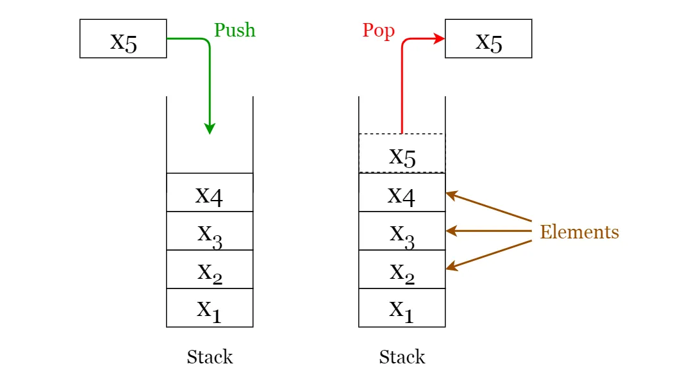
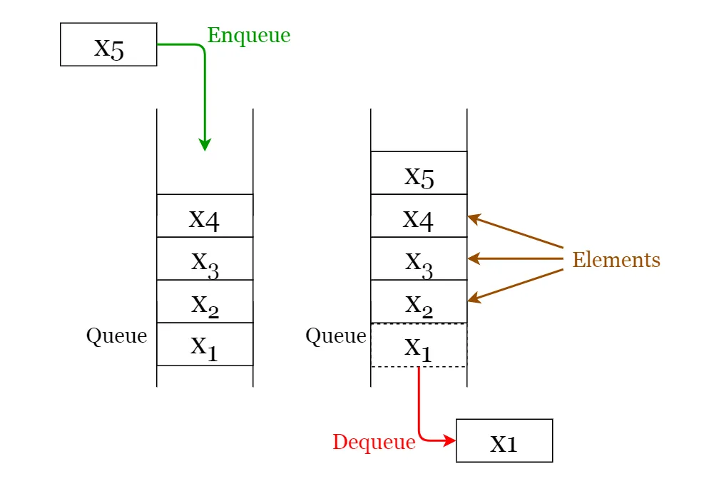
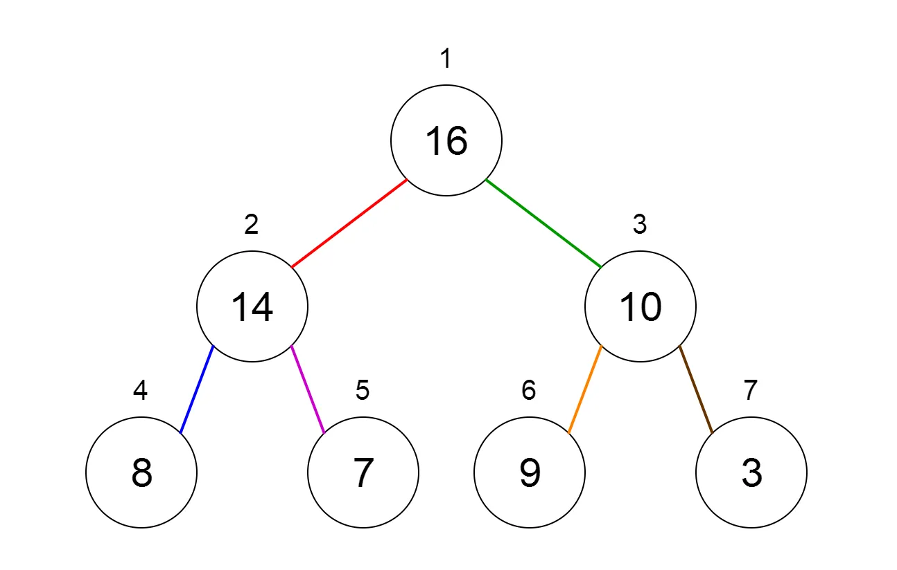

# 数据结构

::: info 简介
数据结构是一种在计算机中组织和存储数据的特殊方法，这样我们就可以更有效地对存储的数据执行操作
:::

## 数组
数组是固定大小的结构，可以保存相同数据类型的项目  
它可以是整数数组、浮点数数组、字符串数组，甚至是数组数组（例如二维数组）
数组是索引的，这意味着随机访问是可能的  

**操作**
- 遍历: 浏览元素并打印它们
- 搜索: 在数组中搜索元素，您可以按元素的值或索引搜索元素
- 更新: 更新给定索引处现有元素的值
- 插入: 在指定索引插入一个或多个元素
- 删除: 在指定索引删除一个或多个元素

## 链表
链表是一种顺序结构，由一系列线性顺序的项目组成，这些项目相互链接  
因此，您必须按顺序访问数据，并且无法进行随机访问  
链表提供了动态集的简单灵活的表示形式  

1. 链表中的元素称为节点
2. 每个节点都包含一个键和一个指向其后续节点的指针，称为 next
3. 名为 head 的属性指向链表的第一个元素
4. 链表的最后一个元素称为尾巴

**种类**
1. 单向链表: 只能向后方向遍历项目，由 next 指向后一个节点
2. 双向链表: 可以在向前和向后方向遍历项目。节点由一个称为 prev 的附加指针组成，指向前一个节点
3. 循环链表: 链表，其中头部的上一个指针指向尾部，尾部的下一个指针指向头部

**操作**
- 搜索: 通过简单的线性搜索在给定链表中找到第一个键为 k 的元素，并返回指向该元素的指针
- 插入: 在链表中插入键。插入可以通过 3 种不同的方式完成; 插入列表开头，插入列表末尾，插入列表中间。
- 删除: 从给定链表中删除元素 x。不能通过一个步骤删除节点。可以通过 3 种不同的方式进行删除; 从列表开头删除，从列表末尾删除，从列表中间删除。

## 栈
栈是一种LIFO（后进先出 - 放置在最后的元素可以首先访问）结构  
从栈顶放入元素的操作叫入栈，取出元素叫出栈  

## 队列
队列是一种FIFO（先进先出 - 首先放置的元素可以首先访问）结构  
它类似于现实人们在队列中等待，队列可以在一端添加元素，在另一端取出元素

## 堆
堆是二叉树的一种特例，属于`完全二叉树`，其中父节点与其值的子节点进行比较，并相应地排列  
不必将值一个个地插入堆中，通过交换形成堆

**种类**
- 最小堆: 父级的键小于或等于其子级的键。这称为`最小堆`属性。根将包含堆的最小值。
- 最大堆: 父项的键大于或等于其子项的键。这称为`最大堆`属性。根将包含堆的最大值。

**操作**
- 从顶部开始，从左往右排放，先顶部放置一个节点，每个节点最多放两个子元素，子元素和父节点比较大小并交换，当前行若放满则换行继续按照此方式依次排放
- 从底部开始，从右往左取出，先取出顶部一个节点，将最底部元素放到顶部位置，该节点和子元素比较大小并交换，交换后取出元素并继续按照此方式依次放入顶部

## 树
## 哈希表
## 图