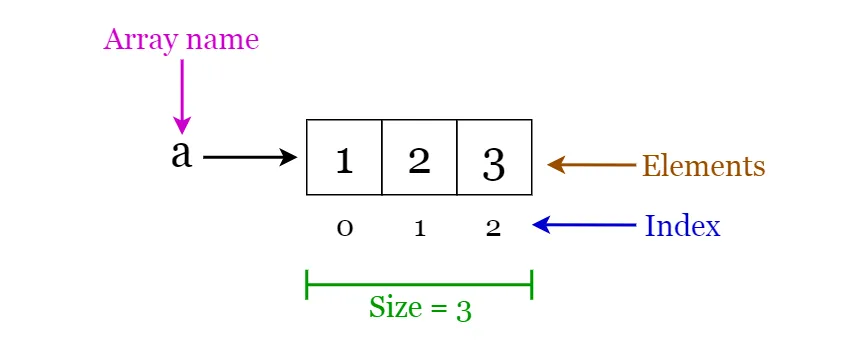

# 数据结构

::: info 简介
数据结构是一种在计算机中组织和存储数据的特殊方法，这样我们就可以更有效地对存储的数据执行操作
:::

## 数组
数组是固定大小的结构，可以保存相同数据类型的项目  
它可以是整数数组、浮点数数组、字符串数组，甚至是数组数组（例如二维数组）
数组是索引的，这意味着随机访问是可能的  

- 遍历: 浏览元素并打印它们
- 搜索: 在数组中搜索元素，您可以按元素的值或索引搜索元素
- 更新: 更新给定索引处现有元素的值
- 插入: 在指定索引插入一个或多个元素
- 删除: 在指定索引删除一个或多个元素

**应用**
- 用作构建其他数据结构（如数组列表、堆、哈希表、向量和矩阵）的构建块
- 用于不同的排序算法，如插入排序、快速排序、气泡排序和合并排序

## 链表
## 栈
## 队列

## 堆
## 树
## 哈希表
## 图