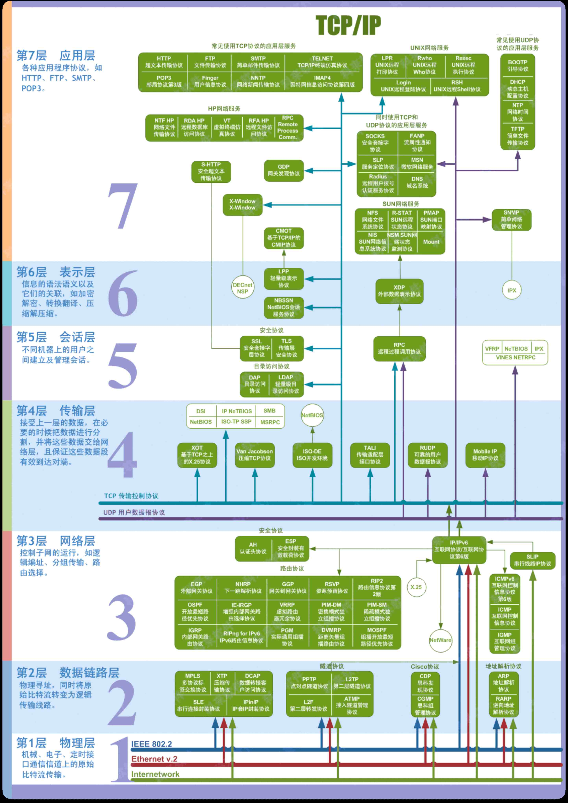
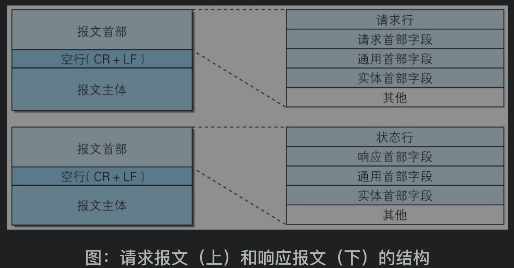
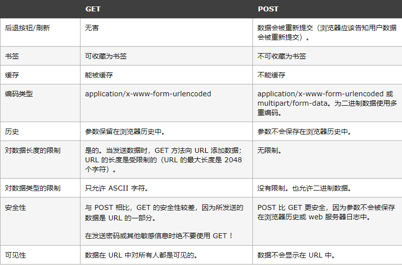
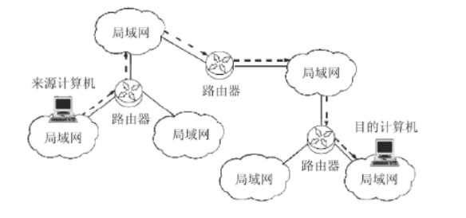
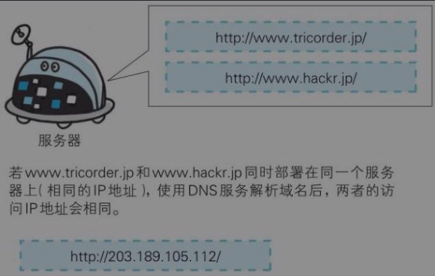

# Http Basics
## 网络模型
:::info 简介
首先我们来看几张图，了解下网络的模型结构  
国际标准 OSI模型 有7层结构，广泛应用的 TCP/IP模型 可以分为5层/4层结构  

  
  


:::

## URI
:::info 简介
URI（**统一资源标识符**）用于标识某一互联网资源名称的字符串  
URI 是一种抽象宽泛的定义。即，不管用什么方法表示，只要能唯一标记某个资源，它就叫URI  
通常已http:、ftp:、mailto:、file:，和协议对应的内容所构成  

- URL（**统一资源定位符**）用于标识某一互联网资源名称的字符串，URL 是 URI 的一个子集  
  - 比如：http://www.aspxfans.com:8080/news/day01/index.asp?boardID=5&pwd=24618&page=1#name  
    - 协议部分 http:            (浏览器协议)
    - 域名部分 www.aspxfans.com (域名通过DNS转换为IP，识别主机服务器)
    - 端口部分 :8080            (识别主机的对应进程)
    - 目录部分 /news/day01/     (资源路径)
    - 文件部分 index.asp        (查找的对应文件)
    - 参数部分 boardID=5&pwd=24618&page=1 (参数)
    - 锚定部分 name             (#指定了网页中的一个位置)
:::
参考链接：https://developer.mozilla.org/zh-CN/docs/Learn/Common_questions/What_is_a_URL

## 应用层 - HTTP
:::info 简介
HTTP（**超⽂本传输协议 HyperText Transfer Protocol** ）  
每个 HTTP请求都是⽆状态的，可以把 HTTP的⼀次请求当作⼀次事务  
HTTP是应⽤层通信协议，旨在在联⽹设备之间传输信息，HTTP标准化了客户端和服务器之间的通信⽅式  
HTTPS：在 HTTP基础上，增加 **传输加密** 和 **身份认证** 保证传输过程的安全性
:::

:::info HTTP结构



:::
参考链接：https://developer.mozilla.org/zh-CN/docs/Web/HTTP

## HTTP报文
:::info 简介
报文：是网络中交换与传输的数据单元，即站点一次性要发送的数据块  
HTTP传输分为 **报文首部** 和 **报文主体**
:::

- **请求行**
  - HTTP 请求 Method、URI、Version ( GET /URI HTTP/1.1 )
- **状态行**
  - HTTP 响应 Version、Status Code、Reason ( HTTP/1.1 200  OK )
- **首部字段**
  - 包含表示请求和响应的各种条件和属性的各类首部
  - **通⽤⾸部字段**：请求报⽂和响应报⽂两⽅都会使⽤的头部  
    |  首部字段名   | 说明  |
    |  ----  | ----  |
    | Cache-Control	| **控制缓存的行为**
    | Connection | **连接管理**
    | Date | **创建报文的日期时间**
    | Pragma | **报文指令**
    | Trailer | **报文末端的首部一览**
    | Trailer-Encoding | **指定报文主体的传输编码方式**
    | Upgrade | **升级为其他协议**
    | Via | **代理服务器的相关信息**
    | Warning | **错误通知**
  - **请求⾸部字段**：从客户端向服务器端发送请求报⽂使⽤的头部  
    |  首部字段名   | 说明  |
    |  ----  | ----  |
    | Accept | **用户代理可处理的媒体类型**
    | Accept-Charset | **优先处理字符集**
    | Accept-Encoding | **优先的内容编码**
    | Accept-Language | **优先的语言**
    | Authorization | **Web认证信息**
    | Expect | **期待服务器的特定行为**
    | From | **用户的电子邮箱地址**
    | Host | **请求资源所在的服务器**
    | If-Match | **比较实体标记**
    | If-Modified-Since | **比较资源的更新时间**
    | If-None-Match | **比较实体标记（与If-Match相反）**
    | Max-Forwards | **最大传输逐跳数**
    | Proxy-Authorization | **代理服务器要求客户端的认证信息**
    | Range | **实体的字节范围请求**
    | Referer | **对请求中URI的原始获取方**
    | TE | **传输编码的优先级**
    | User-Agent | **HTTP客户端程序的信息**
  - **响应⾸部字段**：从服务端向客户端返回响应报⽂时使⽤的头部  
    |  首部字段名   | 说明  |
    |  ----  | ----  |
    | Accept-Ranges | **是否接受字节范围请求**
    | Age | **推算资源创建经过时间**
    | ETag | **资源的匹配信息**
    | Location | **令客户端重定向至URI**
    | Proxy-Authenticate | **代理服务器对客户端的认证信息**
    | Retry-After | **对再次发器请求的时机要求**
    | Server | **HTTP服务器的安装信息**
    | Vary | **代理服务器缓存的管理信息**
    | WWW-Authenticate | **服务器对客户端的认证信息**
  - **实体⾸部字段**：针对请求报⽂和响应报⽂的实体部分使⽤的⾸部（如补充资源内容更新时间等与实体有关的信息）
    |  首部字段名   | 说明  |
    |  ----  | ----  |
    | Allow | **资源可支持的HTTP方法**
    | Content-Encoding | **实体主体适用的编码方式**
    | Content-Language | **实体主体的自然语言**
    | Content-Length | **实体主体的大小（单位：字节）**
    | Content-Location | **替代对应资源的URI**
    | Content-MD5 | **实体主体的报文摘要**
    | Content-Range | **实体主体的位置范围**
    | Content-Type | **实体主体的媒体类型**
    | Expires | **实体主体过期的日期时间**
    | Last-Modified | **资源的最后修改日期时间**
参考链接：https://developer.mozilla.org/zh-CN/docs/Web/HTTP/Headers

## HTTP状态码
:::info 简介
状态码的职责是当客户端向服务器端发送请求时，描述返回的请求结果
:::
|  首部字段名   | 说明  |
|  ----  | ----  |
| 1xx(信息响应) | 接收的请求正在处理
| 2xx(成功响应) | 请求正常处理完毕
| 200 | 正常处理，请求成功
| 204 | 请求处理成功，但是没有响应主体
| 206 | Content-Range 指定范围的实体内容
| 3xx(重定向消息) | 需要进行附加操作以完成请求
| 301 | 永久重定向 (表示请求的资源已被分配了新的URI，以后应使用资源现在所指的URI，会去更新书签的URI)
| 302 | 临时重定向 (表示请求的资源已被分配了新的URI，希望用户（本次）能使用新的URI访问，保留书签对应的URI)
| 303 | 临时重定向 (表示请求的资源已被分配了新的URI，希望用户（本次）能使用新的URI访问，保留书签对应的URI，但应当使用GET请求)
| 304 | 资源已找到，但未符合条件请求 (比如该请求返回的文件，文件未被修改，对客户端有缓存情况下服务端的一种响应，返回缓存文件)
| 4xx(客户端错误响应) | 服务器⽆法处理请求
| 400 | 请求语法错误
| 401 | 请求需要账户密码认证
| 403 | 请求资源的访问被服务器拒绝
| 404 | 服务器没有找到请求资源
| 5xx(服务端错误响应) | 服务器处理请求出错
| 500 | 服务器发⽣错误
| 503 | 服务器暂时处于超负载或处于停机维护

参考链接：https://developer.mozilla.org/zh-CN/docs/Web/HTTP/Status

## HTTP方法
:::info 简介
根据 HTTP 标准，HTTP 请求可以使用多种请求方法  
|   请求方法    |   说明   |
|  ----  | ----  |
|  GET  |  请求指定的页面信息，并返回实体主体
|  HEAD  |  类似于 GET 请求，只不过返回的响应中没有具体的内容，用于获取报头
|  POST  |  向指定资源提交数据进行处理请求（例如提交表单或者上传文件），数据被包含在请求体中。POST 请求可能会导致新的资源的建立和/或已有资源的修改
|  PUT   |  从客户端向服务器传送的数据取代指定的文档的内容
|  DELETE  |  请求服务器删除指定的页面
|  CONNECT  |  HTTP/1.1 协议中预留给能够将连接改为管道方式的代理服务器
|  OPTIONS  |  用于描述目标资源的通信选项
|  TRACE  |  回显服务器收到的请求，主要用于测试或诊断
|  PATCH  |  是对 PUT 方法的补充，用来对已知资源进行局部更新


:::
参考链接：https://developer.mozilla.org/zh-CN/docs/Web/HTTP/Methods

## HTTP优缺点
:::info 简介
**HTTP**
优点：
1. 简单、灵活、易于扩展
2. 无状态，性能更好，减少网络资源消耗
缺点：
1. 通信使⽤明⽂（不加密），内容可能被窃听
2. 不验证通信⽅的身份，身份可能遭遇伪装
3. ⽆法证明明⽂的完整性，明⽂可能会被篡改  

**HTTPS**
1. 通过 SSL协议 + 加密 + 认证 + 明⽂完整性保护
2. ⽹站通信进⾏加密
:::

## 传输层 - TCP
:::info 简介
TCP（**传输控制协议 Transmission Control Protocol**）  
是一个面向连接的、可靠的、基于字节流的传输层协议  
TCP 会将接收到所有的报⽂段进⾏组装，如果有部分报⽂段丢失则会让其重新发送，直⾄成功组装完整数据，才会进⼊**应⽤层**  

- 面向连接
  - 客户端和服务器的连接，互相通信之前，TCP 需要三次握手建立连接，四次握手终止连接  
- 可靠的
  - 保证连接的可靠，控制数据传输的完整性，数据的可控制（重传策略）

UDP（**用户数据报协议**）  
无需建立连接就可以发送封装的 IP 数据包的方法，音频和多媒体应用，UDP是最好的选择  
如果有一个消息丢失，在稍后的瞬间之后另一个新的消息就会替换它  

- 无连接
  - 传输数据之前源端和终端不建立连接，不需要维护连接状态
- 不可控（不可靠）
  - 无法保障数据完整性
:::

## TCP 握手
### 建立连接
TCP 作为传输层协议，使用三次握手协议建立连接，该方法可以防止产生错误的连接  

TCP 三次握手的过程如下：
1. 客户端发送SYN（SEQ=x）报文给服务器端，进入SYN_SEND状态。
2. 服务器端收到SYN报文，回应一个SYN （SEQ=y）ACK（ACK=x+1）报文，进入SYN_RECV状态。
3. 客户端检查ACK === x+1，随之发送ACK（ACK=y+1）报⽂给服务端，服务端检查ACK === y+1，
           如果正确则建⽴连接，进入Established状态。

三次握手完成，TCP客户端和服务器端成功地建立连接，可以开始传输数据了。
```js
SYN -> 连接请求，同步标志
ACK -> 确认标志
SYN_SEND -> 发送完一个连接请求后等待一个匹配的连接请求
SYN_RECV -> 发送连接请求并且接收到匹配的连接请求以后等待连接请求确认
Established -> 表示一个建立的连接

client ->                  client发送 SYN（SEQ=x）请求建立连接                 -> server
server -> 收到client请求应答, server回应 SYN （SEQ=y）- ACK（ACK=x+1）请求建立连接  -> client
client -> 检测server的数据 ACK === x+1, 正确则发送 ACK（ACK=y+1）, 服务器检测client的数据 ACK === y+1, 正确则建立连接 -> server
```

为什么不两次握手？  
客户端如果由于网络阻塞重发送了两次 SYN，服务端回应第一次的 SYN + ACK，服务端不知道客户端是否接收到 SYN + ACK，第二次 SYN 延迟送达
服务端依然会发送 SYN + ACK，因为服务端不知道客户端是否接受到 确认标志，这样会浪费服务端的资源  

为什么不四次握手？  
浪费服务端资源，服务端的 SYN + ACK 可以一次性发送  


### 连接终止
TCP 连接的终止一个连接要经过四次握手  
1. Client发送一个FIN并包含一个随机的seq=a，主动关闭Client到Server的数据传送，Client进入FIN_WAIT_1状态
1. Server收到FIN后，发送一个ACK并包含一个seq=a+1给Client,Server进入CLOSE_WAIT状态。
1. Server发送一个FIN并包含一个随机的seq=b和一个ACK=a+1,用来关闭Server到Client的数据传输，Server进入LAST_ACK状态。
1. Client收到FIN后，Client进入TIME_WAIT状态，接着发送一个ACK并包含一个seq=b+1给Server,Server收到ACK包后进入CLOSED状态，完成四次挥手

```js
FIN -> 结束标志
seq -> 随机序列
ACK -> 确认标志
FIN_WAIT_1 -> 等待远端TCP 的连接终止请求
CLOSE_WAIT -> 等待本地连接终止请求
LAST_ACK -> 等待先前发送给远端TCP 的连接终止请求的确认
TIME_WAIT -> 等待足够的时间过去以确保远端TCP 接收到它的连接终止请求的确认
CLOSED -> 关闭连接状态

client -> client发送 FIN（seq=a） -> server
server -> 收到client的 FIN，发送 ACK（seq=a+1） -> client
server -> server发送 FIN（seq=b）- ACK（ACK=a+1） -> client
client -> 收到server的 FIN，client进入等待连接终止，并发送 ACK（seq=b+1），server收到 ACK 后进入关闭状态 -> server
```


## 网络层 - IP
:::info 简介
IP（**Internet Protocol 网际互连协议**）  
是一种端到端的，数据传输服务协议，主要解决的是通信双方寻址的问题  

**IP协议**
- IPV4：2019年IPV4地址分配完毕，地址个数4,294,967,296
- IPV6

**IP地址类型**
- 公有地址，可以直接访问 Internet
- 私有地址，局域网访问
  1. A类 10.0.0.0--10.255.255.255
  2. B类 172.16.0.0--172.31.255.255
  3. C类 192.168.0.0--192.168.255.255
:::

## IP 服务
IP 所提供的服务大致可以归为两大类：

### IP信息包的传送
IP是网络之间信息传送的协议，端到端传输数据，IP必须依赖**IP地址**与**IP路由器**两种机制来实现

### IP信息包的分割与重组
IP信息包传输过程中的太大则可能将信息进行分割，目的设备接收后再重组

- **IP地址**
  - 网络上每台⽹络设备都是独⼀⽆⼆的IP地址，如：192.168.1.1标识着一个网络设备的IP地址
  - 每个IP信息包都必须包含有目的设备的IP地址
- **IP路由**
  - 互联网是由许多个网络连接所形成的大型网络，网络之间还必须有传送的机制，将IP信息包通过一个个的网络传送到目的地，此种传送机制称为IP路由
  - 目的设备是否收到每个信息包、是否收到正确的信息包等，则由上层的协议(例如TCP)来负责检查
- **IP信息包的分割与重组**
  - IP信息包在传送过程中，可能会经过许多个使用不同技术的网络
  - 假设IP信息包是从ATM网络所发出，原始长度为9180B，如果IP路由途中经过以太网络，便面临信息包太大，无法在以太网络上传输的障碍
  - 为了解决此问题，路由器必须有IP信息包分割与重组的机制，将过长的信息包进行分割，以便能在最大传输单位较小的网络上传输。分割后的IP信息包，由目的设备接收后重组，恢复成原来IP信息包。



## 域名/DNS
:::info 简介
域名系统（英文：Domain Name System，缩写：DNS）  
将域名和IP地址相互映射的一个分布式数据库，能够使人更方便地访问互联网  
DNS是⼀个分布式数据库，如果所访问的 DNS服务器不存在计算机请求的域名，则会重定向到另⼀台 DNS服务器

**举例：**
  - 域名：https://www.baidu.com 对应 IP：14.215.177.39
  - 访问域名可以看到百度页面，访问IP也可以看到百度页面
  - 因为IP不好记，所以通过域名与IP的映射来绑定，大家通过域名就可以访问到对应的IP地址，从而访问对应的数据信息

**解析：**
  - 输入域名，首先会在本机的**hosts.txt**寻找是否有对应的域名IP映射，如果有则用对应的IP，加快对域名解析
  - 如果**hosts.txt**没有对应的IP映射，则通过网络在**网络域名服务器**上寻找对应的IP

**浏览器输入域名**
1. 查找浏览器缓存
1. 查找DNS缓存
1. 本机文件Hosts文件，域名对应的IP映射
1. 递归DNS服务器查找
1. TLD顶级域名服务器
1. 权威域名服务器，在次服务器找到对应的IP并返回
1. 然后返回到递归DNS服务器，在这里可能被缓存
1. 最后将IP发送回浏览器，浏览器通过IP访问服务器




:::

