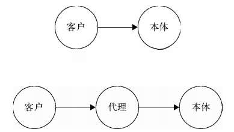

# JavaScript Design Mode

::: info 设计模式
设计模式是解决某个特定场景下对某种问题的解决方案  
设计模式可能会增加复杂的逻辑，或更多的代码量  
作用: 让人们写出可复用和可维护性高的程序
:::
## 工厂模式
:::info 简介
不涉及到 User 的具体的实现类，达到封装效果，主要用来创建同一类对象 (产品)  
  
优点：  
    1. 你只需要一个正确的参数，就可以获取到你所需要的对象，而无需知道其创建的具体细节  
    2. 扩展性高，可任意扩展  
    3. 当不同实例都有相同的行为时，就可使用工厂模式  
缺点：  
    1. 每增加一个产品，相应的也要增加一个子工厂，加大了额外的开发量  

```js
class User {
    //构造器
    constructor(opt) {
        this.name = opt.name;
        this.viewPage = opt.viewPage;
    }
    //静态方法
    static getInstance(role) {
        switch (role) {
        case "superAdmin":
            return new User({
                name: "超级管理员",
                viewPage: ["首页", "通讯录", "发现页", "应用数据", "权限管理"],
            });
            break;
        case "admin":
            return new User({
                name: "管理员",
                viewPage: ["首页", "通讯录", "发现页", "应用数据"],
            });
            break;
        case "user":
            return new User({
                name: "普通用户",
                viewPage: ["首页", "通讯录", "发现页"],
            });
            break;
        default:
            throw new Error("参数错误, 可选参数:superAdmin、admin、user");
        }
    }
}

// 调用
let superAdmin = User.getInstance("superAdmin");
let admin = User.getInstance("admin");
let normalUser = User.getInstance("user");
```
:::

## 单例模式
:::info 简介
保证一个类仅有一个实例，并提供一个访问它的全局访问点  
要创建一个标准的单列模式并不复杂，无非是通过一个变量来标志当前是否已经为某个类创建过对象
  
优点：  
    1. 内存中只有一个实例，减少内存开支  
    2. 减少系统的性能开销  
缺点：  
    1. 扩展很困难  
    2. 单例类的职责过重，在一定程度上违背了"单一职责原则"  

```js
let Single = function(name) {
    this.name = name
    this.instance = null
}
Single.prototype.getName = function() {
    console.log(this.name)
}
Single.getInstance = function (name) {
    if (!this.instance) {
        this.instance = new Single(name)
    }
    return this.instance
}
let one = Single.getInstance('one')
let two = Single.getInstance('two')
```
:::

## 策略模式
:::info 简介
定义一系列的算法，把它们一个个封装起来，并且使它们可以相互替换  
重心在于组织、调用这些算法，从而让程序结构更灵活，具有更好的维护性和扩展性  
   
优点：  
    1. 避免代码重复，更好的封装性   
    2. 避免使用多重条件语句，易于扩展，易于切换   
缺点：   
    1. 客户端必须知道所有的策略类，并自行决定使用哪一个策略类   

```js
let strategies = {
    "S":(salary) => {
        return salary * 4
    },
    "A":(salary) => {
        return salary * 3
    },
    "B":(salary) => {
        return salary * 2
    },
}
let calculateBonus = (level, salary) => {
    return strategies[ level ](salary)
}
calculateBonus('S', 10000)
calculateBonus('A', 10000)
```
:::

## 代理模式
:::info 简介
一个类别可以作为其它东西的接口，以便控制对它的访问  
代理对象，对目标对象做出一定的响应事件  
   
优点：  
    1. 将代理对象与真实被调用的目标对象分离  
    2. 保护目标对象的作用  
    3. 对目标对象的功能增强  
缺点：   
    1. 客户端和目标对象增加一个代理对象，会造成请求处理速度变慢  
    2. 增加系统的复杂度
  


```js
// 客户对象
let start = {
  // 请求
  invite(data){
    data && middle.reception(data)
  }
}
// 代理
let middle = {
  // 代理收数据，做处理
  reception(data){
    data.host ??= '8080'
    // 处理完成，提交给目标本体对象
    target.reception(data)
  }
}
// 亮
let target = {
  // 接收请求
  reception(data){
    console.log(data)
  }
}
// 调用方法
start.invite({ url: 'http:www.baidu.com', host: '9000' })

```
:::

## 观察者模式 (发布订阅)
:::info 简介
一对多的依赖关系，当一个对象状态发生改变时，所有依赖于它的对象都将得到通知  
多个订阅者，只需要等发布者通知订阅者即可  
多个订阅者订阅某事件，当某事件触发时 (发布)，订阅者 (订阅)事件  
   
优点：  
    1. 观察者和被观察者是抽象耦合的  
    2. 建立一套触发机制  
缺点：   
    1. 如果观察者对象有很多，都通知到会花费很多时间  
```js
// 主体
class Subject {
    observers = [];
    state;

    getState() {
        return this.state;
    }
    setState(state) {
        this.state = state;
        this.notifyAllObservers();
    }
    // 放入观察者实现类
    attach(observer) {
        this.observers.push(observer);
    }
    // 通知所有观察者
    notifyAllObservers() {
        for (let observer in this.observers) {
            this.observers[observer].update();
        }
    }
}
// 观察者抽象类
class Observer {
    constructor() {
        if (new.target === Observer) {
            throw new Error("Vehicle");
        }
    }
    subject;
    update() {}
}
// 观察者实现类
class BinaryObserver extends Observer {
    constructor(subject) {
        super();
        this.subject = subject;
        this.subject.attach(this);
    }
    update() {
        console.log("Binary String: " + subject.getState());
    }
}
let subject = new Subject();
new BinaryObserver(subject);
// 触发订阅
subject.setState(15);
subject.setState(10);
```
:::

参考链接：https://www.runoob.com/design-pattern/design-pattern-tutorial.html