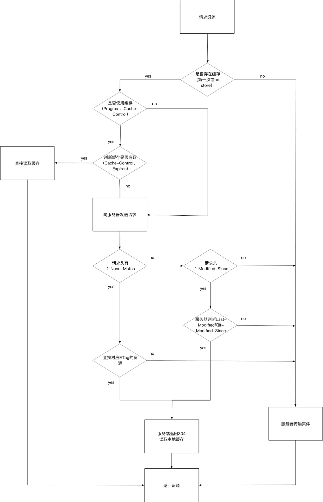

# HTTP 缓存
:::info 简介
web 缓存主要指的是两部分：
1. 浏览器 缓存
   1. LocalStorage
   2. SessionStorage
   3. Cookie
   4. IndexedBD
2. http 缓存
   1. 通过配置 http 请求头来达到缓存的效果

作用：
1. 存储必要的资源
2. 更快速的网络请求
3. 更快速的页面资源加载
4. 减少服务器资源消耗
:::

## HTTP 强制缓存
在浏览器中，强缓存分为：
1. http1.0 规范：Expires
2. http1.1 规范：Cache-control
### Expires
```js
// expires是根据本地时间来判断的资源是否失效的，假设客户端和服务器时间不同，会导致缓存命中误差
// Response Head
express: Fri, 08 Mar 2029 08:05:59 GMT  // 指定时间和本机时间对比，在指定时间之前都可使用缓存
express: 0  // 仍然会启用缓存，只不过缓存立刻过期
express: -1 // 内容立即过期，在再次显示之前必须重新请求
```
### Cache-control
Cache-Control 的优先级高于 Expires  
强缓存不会发生请求，直接读取缓存

- memory cache（内存缓存）
  - 读取速度快，存于内存
  - 关闭页面，内存中的缓存将释放
- disk cache（磁盘缓存）
  - 缓存再硬盘中，容量大
  - 读取速度慢

先读取 memory cache -> 其次才是 disk cache  
Cache-control 又分为**私有缓存**和**共享缓存**  

```js
/*  私有缓存：内容仅供单个用户使用，应该仅在浏览器中本地缓存 */
Cache-Control: private

/*  共享缓存：所有内容都将被缓存
    1. 浏览器从 HTTP 缓存中寻找匹配的请求
    2. 缓存匹配上，则返回缓存
    3. 缓存匹配上但已经过期，先请求服务器端显示资源没有改动，它将从缓存中返回资源；如果服务器显示资源变动，那么重新从服务器下载资源更新缓存
    4. 缓存没有匹配，则以普通方式请求
*/
Cache-Control: public

/*  浏览器直接从远程服务器获取资源，不查看缓存，不会缓存资源 */
Cache-Control: no-store

/*  浏览器直接从远程服务器获取资源，不查看缓存，会缓存资源 */
Cache-Control: reload

/*  缓存有匹配，浏览器会向远程服务器发出条件请求，如果指示资源没有更改，则将从缓存中返回该资源。否则，将从服务器下载资源并更新缓存
    缓存没有匹配，浏览器将发出正常请求，并使用下载的资源更新缓存 
*/
Cache-Control: no-cache

/*  缓存有匹配，不管是新匹配项还是旧匹配项，都将从缓存中返回
    缓存没有匹配，浏览器将发出正常请求，并使用下载的资源更新缓存
    相当于 max-age=0
*/
Cache-Control: force-cache

/*  缓存有匹配，不管是新匹配项还是旧匹配项，都将从缓存中返回
    缓存没有匹配，浏览器将返回一个错误
*/
Cache-Control: only-if-cached

/*  缓存过期指定为当前时间的增量(以秒为单位)，在访问该请求后的300秒之内不会请求服务器 */
Cache-Control: max-age=300

/*  缓存时间 1年，immutable 指令可用于明确指示不需要重新验证，因为内容永远不会改变
    两次请求都是200 OK，但是第二次是200 OK (来自磁盘缓存)
*/
Cache-Control: max-age=31536000, immutable
```
## HTTP 协商缓存
通过两组请求头，服务器进行校验，如果命中协议缓存，返回304，否则返回新资源以及200  
- 发送请求前，会先去缓存里面查看是否命中强缓存，如果命中，则直接从缓存中读取资源，不会发送请求到服务器
- 当强缓存没有命中时，浏览器一定会向服务器发起请求。服务器会根据 Request Header 中的一些字段来判断是否命中协商缓存，如果经对比后服务器资源未被修改，则返回 304
  1. ETag/If-None-Match（ETag/If-None-Match 优先级更高）
     1. ETag 响应头的值是服务器生成的任意值
     2. If-None-Match 如果该缓存是陈旧的no-cache/max-age=0，则请求标头If-None-Match的值为ETag的值，以询问服务器资源是否已被修改
     3. 服务器ETag 标头的值 === 请求中 If-None-Match 的值，则服务器将返回 304 Not Modified
  2. Last-Modified/If-Modified-Since
     1.  Last-Modified 响应头的值是服务器 认定的资源修改的日期及时间
     2.  If-Modified-Since 为 Last-Modified的值，如果请求的资源从那时起未经修改，那么返回一个不带有消息主体的 304 响应，而在 Last-Modified 首部中会带有上次修改时间
     3.  只可以用在 GET 或 HEAD 请求中
- 如果前两步都没有命中，则直接从服务器加载资源
```js
// 在3600秒后会触发一以下两组协商缓存（max-age=0/no-cache 在之后的每一次都会触发）
Cache-Control: max-age=3600

// 服务器ETag === 请求头If-None-Match，则返回304
ETag: "deadbeef"
If-None-Match: "deadbeef"

// 服务器Last-Modified === 请求头If-Modified-Since，则返回304
Last-Modified: Tue, 22 Feb 2022 22:00:00 GMT
If-Modified-Since: Tue, 22 Feb 2022 22:00:00 GMT
```
## 缓存大致流程


参考链接：https://developer.mozilla.org/zh-CN/docs/Web/HTTP/Caching