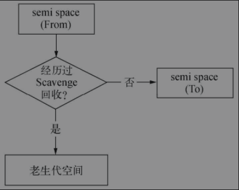
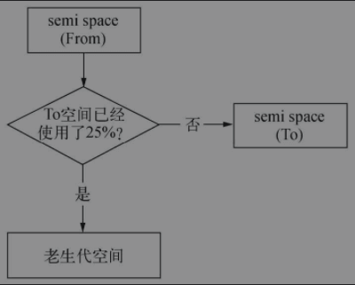
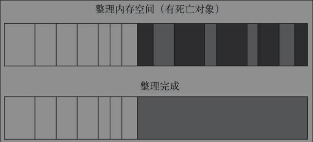

# Node V8内存控制

## 基础

1. Node基于V8引擎使用内存，使用c++编译
   1. V8具有内存限制
   2. 原因是最初是对浏览器而设计的，不需要太大的内存
      1. 内存使用过多就会崩溃（没有足够的内存，内存溢出）
      2. 对象不再使用，而没有被销毁，内存一直没有被释放（内存泄漏）
2. V8垃圾回收机制算法
   1. 对不同对象的存货时间将内存的垃圾回收进不同的分代
   2. 对不同分代的内存使用更高效的回收算法

## 内存分配（V8堆的大小）

1. 新生代的内存空间（生命周期短）
   1. 采用cheney算法，一种复制的方式实现垃圾回收算法
   2. 先是在From空间中进行分配，检测在From空间中的存活对象
   3. 存活对象将被复制到To空间，而非存活对象占用的空间将会被释放（闭包则不会被释放）
   4. 随后进行翻转，To -> From，From到To之前将会进行一次检测，在一定条件下将存活周期长的对象移入老生代
   5. 晋升的条件主要有两个：是否经历过回收依然未被释放，To空间的内存占用超过限制
    
    

2. 老生代的内存空间（生命周期长）
   1. 当一个对象经过多次复制依然存活时，它被认为是生周期较长的对象，将会移入到老生代中（称为晋升）
   2. 采用Mark-Sweep标记清除
      1. 标记阶段：遍历堆中的所有对象，并标记活着的对象
      2. 清除阶段：只清除没有被标记的对象
   3. 结合Mark-Compact标记整理
      1. 在标记对象死亡后，在整理过程中，将活着的对象往一端移动
      2. 移动完成后，直接清理掉边界外的内存
    

## 增量标记（Incremental Marking）
1. 为了避免出现JavaScript应用逻辑与垃圾回收器看到的不一致的情况，垃圾回收的3种基本算法都需要将应用逻辑暂停下来，待执行完垃圾回收后再恢复执行应用逻辑，这种行为被称为“全停顿”（stop-the-world）
2. 增量标记：使垃圾回收最大停顿时间可以减少到原本的1/6左右

3. 延迟清理
4. 增量式清理
5. 并行标记、并行清理: 利用多核性能降低每次停顿时间