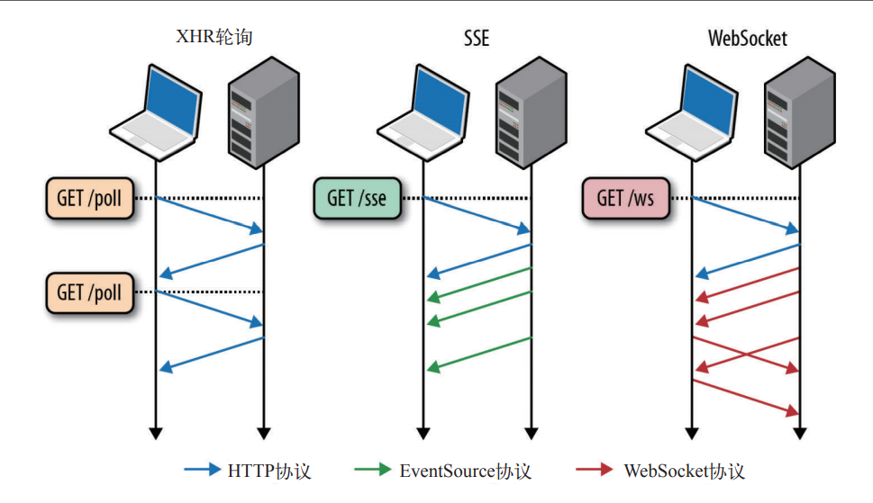
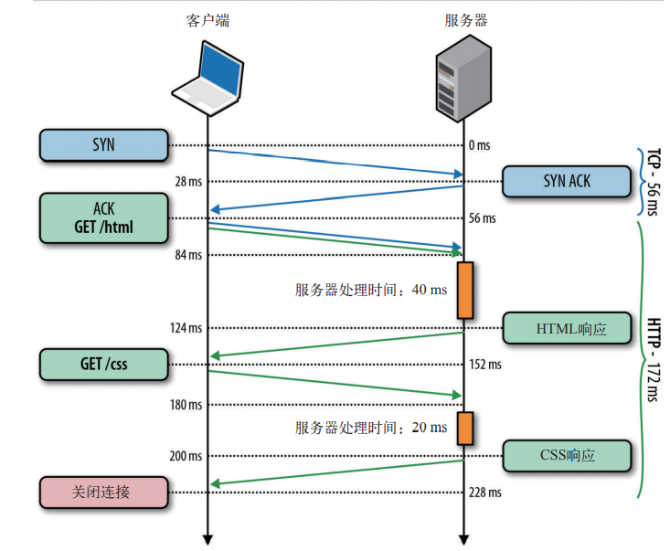

# HTTP Performance Optimization

## DNS
在载入URL后，首先会去请求加载URL的IP，这就涉及到DNS解析时间，DNS优化则可总结为以下两点：
1. 减少DNS请求次数
   1. 在同一个网站中，减少不同域名的使用，使其降低DNS解析的时间
2. 缩短DNS解析时间
   1. 采用`dns-prefetch`，**提前解析第三方服务器的IP地址**，当之后有请求用到该IP时将不再耗费DNS解析时间
   2. 能够有效帮助缩短DNS解析产生的延迟
```html
<link rel="dns-prefetch" href="https://baidu.com/"> 
```
参考链接：https://developer.mozilla.org/zh-CN/docs/Web/Performance/dns-prefetch
## GZIP
HTTP请求头: Accept-Encoding: gzip, deflate, br  
HTTP响应头: Content-Encoding: gzip  

1. 动态压缩: 在nginx.conf配置动态开启gzip，请求发生时nginx实时压缩返回文件
```js
#开启gzip
gzip  on;  
#低于1kb的资源不压缩 
gzip_min_length 1k;
#压缩级别1-9，越大压缩率越高，同时消耗cpu资源也越多，建议设置在5左右。 
gzip_comp_level 5; 
#需要压缩哪些响应类型的资源，多个空格隔开。不建议压缩图片.
gzip_types text/plain application/javascript application/x-javascript text/javascript text/xml text/css;  
#配置禁用gzip条件，支持正则。此处表示ie6及以下不启用gzip（因为ie低版本不支持）
gzip_disable "MSIE [1-6]\.";  
#是否添加“Vary: Accept-Encoding”响应头
gzip_vary on;
```
2. **静态压缩**: 提前将文件压缩成 .gz 格式，请求来了，直接返回即可
```js
# 开启gzip静态文件返回，请求文件中有匹配到 .gz 则返回，无则返回请求文件
gzip_static on;
```
## 缓存
```js
// 开启强制缓存
// 300秒内加载本地缓存，不会去请求服务器，超过时间后会去请求，匹配文件是否修改，无修改则304，有修改则200
add_header Cache-Control max-age=300;

// 开启协商缓存
// 请求会通过 ETag/If-None-Match 或者 Last-Modified/If-Modified-Since 匹配文件是否修改，无修改则304，有修改则200
add_header Cache-Control max-age=0;
```

## 针对协议版本采取优化措施




### connection: keep-live

持久化HTTP，通过重用TCP连接，减少HTTP响应时间